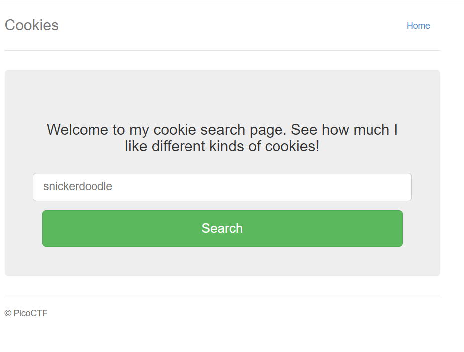
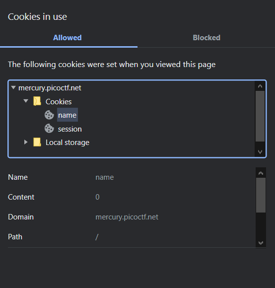
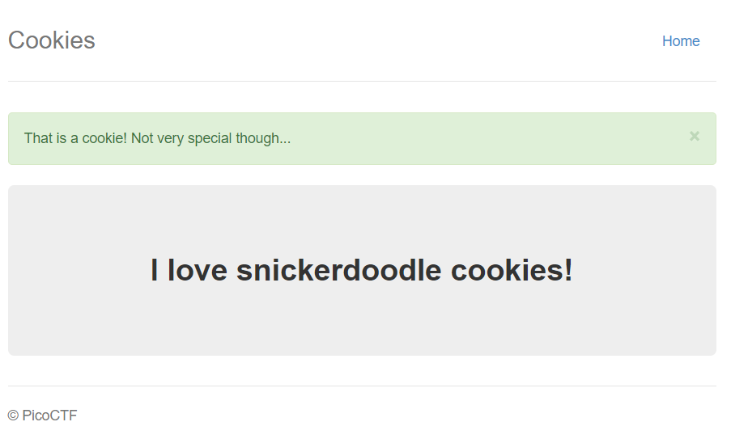
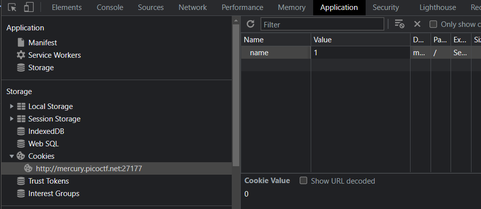
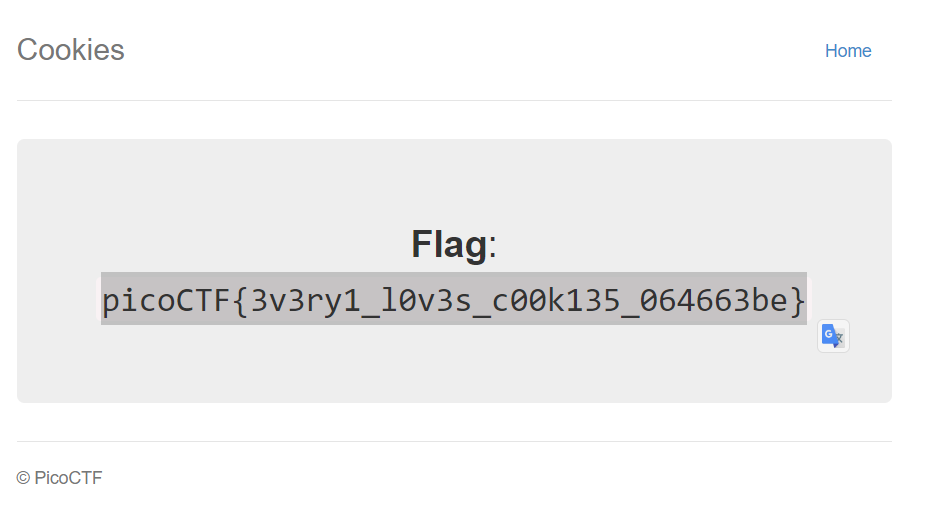

# Cookies

## Overview

Points: 40

Category: Web Exploitation

## Description

Who doesn't love cookies? Try to figure out the best one.

## Hints

(None)

## Approach

The link goes to something that looks like this:

Before typing anything, I checked the cookies I have. How? Clicking on the lock sign near the link (or going to the Inspect page) will reveal. Using the first option, this is the cookie that shows up.

I typed in "snickerdoodle" and entered it.
After inserted, this is what it shows!

Now, let's check the cookie ...

The value changed! Hm... now what? Let's try to change the value to 1 and refreshed the page like this.

After changing the value to 1, this is the phrase that shows.
> I love chocolate chip cookies!

Well, that's a change! I tried to keep increasing the value and when I reached 18, BAM. Found the flag!

## Flag

picoCTF{3v3ry1_l0v3s_c00k135_064663be}
